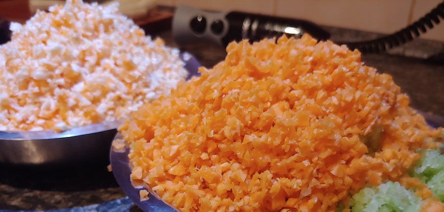
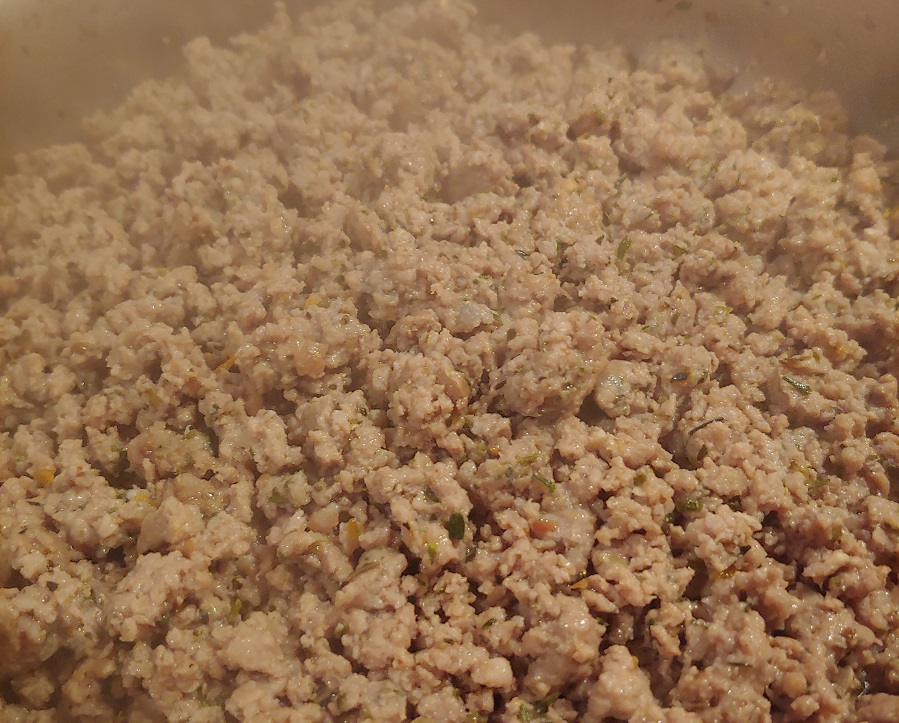
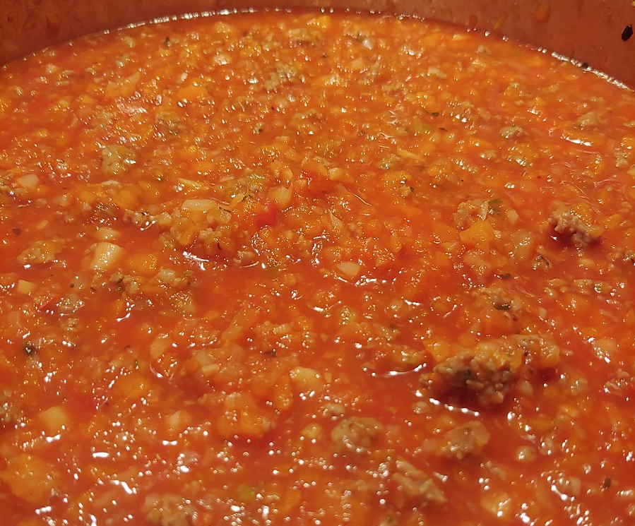

Boloňské ragů či "boloňská" u nás doma patří mezi neoblíbenější pokrmy. Postupně ho ladíme k dokonalosti. Možná ho znáte pod názvem "boloňská omáčka" nebo "boloňské špagety". Ani jedno není správně. Ragů má podstatně hutnější konzistenci než omáčka. A nefunguje moc dobře se špagetami, protože se na nich směs moc dobře neudrží.

Tradičně se používají spíše tagliatelle nebo fettuccine. Osobně preferuji fusilli, radiatori nebo farfalle. Případně rýži, se kterou ragů funguje také výborně.

## Seznam surovin - 12+ porcí

* Žlutá cibule
* Česnek
* Mrkev
* Petržel (kořen)
* Řapíkatý celer
* Mleté maso (mix vepřové a hovězí v poměru 50:50) - 1kg
* Rajčata passata
* Olivový olej
* Těstoviny nebo rýže
* Tymián
* Rozmarýn (mletý)
* Bazalka
* Sůl
* Pepř
* Voda
* Parmazán či tvrdý sýr podobného typu

## Postup - 5 hodin vaření

Pokud chcete mít na oběd opravdu dobrou boloňskou, tak budete muset začít vařit kolem 7 hodiny ráno nebo ideálně začít o den dříve. Je potřeba zpracovat hodně surovin a ragů dlouho vařit. Čas berte s rezervou. My vaříme obří várku na 12 a více porcí a proto trvají přípravy docela dlouho.

Optimální jsou cca 3 hodiny vaření. I to se dá urychlit. Ragů můžete prohlásit za hotové klidně po půl hodině. Vššchno bude dostatečně provařené, ale chutě se nestihnou propojit a nebude to ono. Takže si raději udělejte dost času nebo vaření odložte na jindy.

### Příprava surovin - 60 minut

* Připravte si veškerou zeleninu.
* Oškrábejte a očistěte **mrkev**, **kořenovou petržel** a **řapíkatý celer**.
* Oloupejte a očistěte **cibuli** a **česnek**.
* Všechno omyjte a připravte k dalšímu zpracování.
* Připravte si kuchyňského robota.
* Připravte si větší pánev na sporák a pomalu ji rozehřejte.
* Vyndejte z lednice **mleté maso**, dejte do mísy, nakořeňte **solí**, **mletým pepřem**, **mletým rozmarýnem**, **tymiánem** a **bazalkou**. Směs řádně promíchete a nechte odložit.

### Restování zeleniny a masa - 60 minut

* Do kuchyňského robota vložte **cibuli**, rozsekejte na drobno a rovnou ji můžete začít dozlatova smažit na pánvi na **olivovém oleji**.
* Na drobno rozmixujte **mrkev**, **kořenovou petržel** a **řapíkatý celer** a připravte si vše do misky. Zelenina se klidně může smíchat, ničemu to nevadí.
* Na sporák si připravte velký kastrol a přendejte do něj do hotovou **cibuli**.
* Na pánvi postupně orestujte nasekanou zeleninu a přidávejte ji do kastrolu k cibuli.
* Kastrol pomalu začněte rozehřívat. Pozor, aby se zelenina nespálila.
* Na konec na pánvi orestujte ochucenou směs **mletého masa**.
* Z masa se pravděpodobně vypeče nějaký tuk. Doporučuji si ho odlít bokem a do finální směsi ho přidat dle vlastního uvážení, aby nebyla boloňská zbytečně mastná.
* **Hotové maso** a vypečený tuk přihoďte k zelenině.

### Pomalé vaření a dochucování - 3 hodiny

* Směs zeleniny a masa zalijte **pasírovanými rajčaty**, dle potřeby přidejte vodu. Směs by měla být kompletně ponořená v tekutině, ale neměla by plavat.
* Občas promíchtejte a průběžně ochutnávejte a dochucujte **solí**, **mletým pepřem**, **mletým rozmarýnem**, **tymiánem** a **bazalkou**.
* Dochucujte opatrně a nechejte koření čas, aby se do jídla zapracovalo. Ani jedna z bylinka, by neměla extrémně vynikat na úkor ostatních. A opatrně i se solí. Možná to tak nemusí ze začátku působit, ale boloňskou lze přesolit velice jednoduše.
* Nezapomeňte, že i těstoviny budete vařit v osolené vodě. A jídlo budete při servírování sypat parmazánem, který je také hodně slaný.

### Hotovo, servírujeme

* Uvařte těstoviny nebo rýži.
* Nastrouhejte čerstvý parmazán.
* Nakrájejte pár lístků čerstvé bazalky.
* Do těstovin přidejte ragů, trochu parmazánu a trochu bazalky. Promíchejte a dejte na talíř.
* Dozdobte zbytkem parmazánu a lístky bazalky.
* Dobrou chuť!

## Volitelné suroviny, tipy a poznámky

Do základu můžete přidat i **pancettu** nebo **slaninu**. Osobně mi ale přijde zbytečné a bez většího efektu na výsledné jídlo.

**Máslo** může přijít do cibulového základu. Osobně mi ale přijde zbytečné, bez většího efektu na výsledné jídlo.

Přidat do masového základu **červené víno** jsme zatím nezkoušeli, ale otestujeme při dalším vaření.

Požívejte sušený mletý **rozmarýn**. Celý čerstvý nebo celý sušený rozmarýn případně poctivě překrájete nebo rozdrťte v moždíři, protože je příliš tvrdý a nehodí se do textury ragů.

Někdo do boloňské přidává **bobkový list**. Vyzkoušel jsem a nevidím v tom moc velký přínos. Ale zkusit to můžete.

**Sýr** nekupujte strouhaný. Předem nastrouhaný sýr ztratí trochu vůně a hlavně objemu.

Mix mletého masa 50:50 vepřové a hovězí je prověřený tip. Zkoušel jsem čistě hovězí (ušlo) i čistě vepřové (nic moc). Ani jedno nefungovalo.

**Čerstvou bazalku** už používám jen na zdobení a finální dochucení. Do vaření se moc nehodí. Buď se v jídle ztratí nebo začne přebíjet jiné chutě. Používám proto do vaření boloňské jen sušenou drcenou bazalku, kterou mám lépe pod kontrolou.
