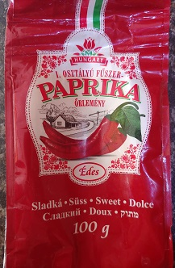

Jedno z mých nejoblíbenějších jídel. Luxusní šťavnaté kuře s dokřupava yvpečenou kůžičkou a hromadou parádní paprikové omáčky. Nepřekonatelné.

## Seznam surovin (4 porce)

* Kuře
* Žlutá cibule
* Mletá paprika (sladká)
* Smetana ke šlehání (31 %)
* Rýže
* Máslo
* Škrob
* Sůl
* Pepř

## Postup (1,5 hodiny vaření)

Hodně záleží zda se rozhodnete použít celé kuře. A jak s ním budete pracovat. Nejjednodušší je koupit kuřecí stehna a dá je upéct do trouby. To je taková klasika, která neurazí. Ale pokud jste náročnější, tak se to dá posunout o kousek dál tím, že celé kuře poctivě vykostíte a pak pěkně pomalu opečete na pánvi. Výhodou je, že budete mít kosti na vyvaření do omáčky, ale také dost kostí na kuřecí vývar, na který stačí přikoupit trochu kořenové zeleniny a můžete ho vařit souběžně.

### Příprava surovin - 15 minut

* Rozporcujte a vykostěte **kuře**. Kosti nevyhazujte.
* Oloupejte **cibuli** a nakrájejte nadrobno.

 

### Papriková omáčka - 30-60 minut

* Orestujte do zlatova **cibuli**, přidejte trošku **másla**, zlehka posypejte **škrobem**, hojně **paprikou**, přijte **kosti ze stehen** a zalejte **vodou**.
* Vařte alespoň 30 minut, aby se stihly vyvařit kosti ze stehen. Když budete vařit déle omáčce to rozhodně neublíží.
* Pokud omáčka není dostatečně hustá, tak si v mističce důkladně rozmíchejte **škrob** s vodou, přilejte k omáčce a pár minut provařte.
* Dle potřeby průběžně dochucujte **solí**, **pepřem** a **mletou paprikou**.
* Z omáčky vytáhněte kosti. A řádně ji prožeňte tyčovým mixérem, aby v ní nezůstaly žádné kousky.
* Do omáčky přilejte trošku **smetany** na zjemnění. Stačí jen 50-70 ml. Znovu prožeňte tyčovým mixérem.
* Omáčku finálně dochuťte **solí**, promíchejte a přes jemné sítko preceďte. Sítko zachytí všechno co v omáčce být nemá - větší kousky pepře, nerozmixovanou cibuli a škorobové žmolky.

### Maso a rýže - 15 minut

* Dejte vařit **rýži** v osolené vodě.
* **Kuře** poctivě **osolte** a **opepřete**.
* Rozpalte si pánev. Dejte na ni trošku oleje a kůží dospod začněte pomalu opékat kuře.
* Až je kůžička za 10-15 minut pěkně vypečená do křupava, tak otočte a opečte i z druhé strany. Stehno bude trvat už jen cca 2 minuty, prso cca 4 minuty.

### Hotovo, servírujeme

* Na talíř dejte **rýži**. Opečený šťavnatý **kuřecí prsní** nebo **stehnení řízek** s křupavou kůžičkou.
* Zalejte **paprikovou omáčkou**.
* Do omáčky nakapejte trošku výpeku z kuřete.
* Dozdobte nějakou čerstvou bylinkou dle chuti a možností - petržel, pažitka, bazalka.

## Volitelné suroviny, tipy a poznámky

**Mletá paprika** je nejdůležitější surovina na tomto receptu. Obyčejná sladká paprika je fajn. Můžete přidat i trošku pálivé, aby mělo jídlo větší šmrnc. Osobně ujíždím na maďarské paprice, která je o něco chutnější a výraznější, než běžná sladká paprika dostupná v supermarketech.

**Celé kuře** je na zpracování složitejší než když si koupíte balení stehen nebo stehenních řízků. Má ovšem pár výhod. Naučíte se něco nového. Ušetříte, protože celé kuře je na kila levnější než jednotlivé díly. Získáte zároveň i suroviny a kosti na kuřecí vývar. A kvalitnější kuřata se prostě prodávají v celku.
