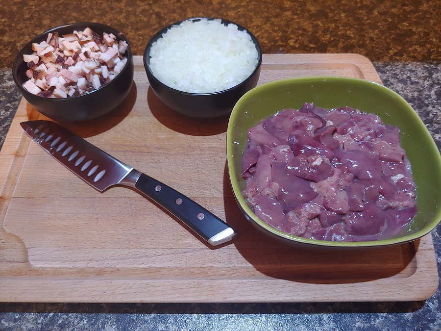
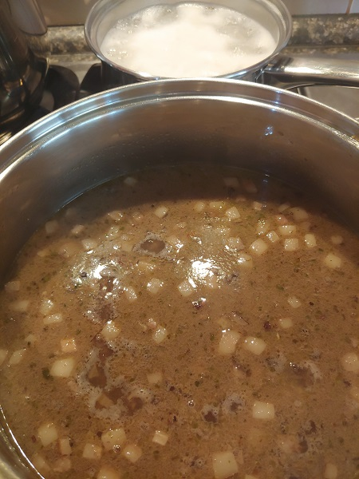
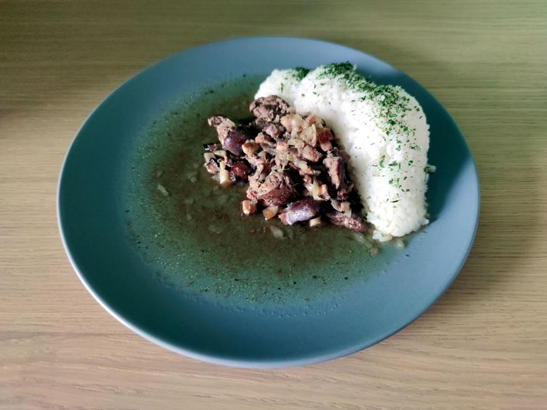

Játra na cibulce jsou parádní a levná rychlovka. Pokud se nerozhodnete koupit prémiová játra z farmářského kuřete.

## Seznam surovin (4 porce - 170 Kč)

* Kuřecí játra - 0,5 Kg - 80 Kč
* Žlutá cibule - 250 g - 5 Kč
* Slanina - 150 g - 60 Kč
* Rýže - 200 g - 25 Kč
* Majoránka
* Petržel
* Pepř
* Sůl
* Voda

## Postup (45 minut vaření)

U tohoto receptu neočekávejte žádné velké složitosti. Jen si pamatujte, že je ideální dušená játra solit až úplně na konci.

### Příprava surovin - 15 minut

* **Kuřecí játra** propláchněte, očistěte a případně pokrájejte na menší kousky.
* **Cibuli** oloupejte a nakrájejte nadrobno.
* **Slaninu** nakrájete na malé kostičky.

### Restování - 15 minut  

* **Cibuli** v menším hrnci orestujte do zlatova.
* Do hrnce přidejte **slaninu** a nechejte trochu vypéct.
* Do hrnce přidejte **játra** a lehce orestujte.

### Dušení jater a vaření rýže - 15 minut

* Směs v hrnci lehce **opepřete**. Přidejte špetku **majoránky**.
* Směs promíchejte a zalejte vodou a nechejte cca 15 minut podusit.
* Dejte vařit **rýži**.
* Hotová dušená játra **osolte**.

### Hotovo, servírujeme

* Na talíř dejte **rýži**.
* Přidejte **dušená játra na cibulce se slaninou** a štávu.
* Dozdobte **petrželkou**.

## Volitelné suroviny, tipy a poznámky

* Čerstvá **kuřecí játra** se rychle kazí. Tuto surovinu proto moc dlouho neskladujte a uvařte co nejdříve.

* **Kuřecí játra** jsou uvařená opravdu za chvilku. Proto je na sporáku moc dlouho netrapte, ať nejsou příliš vysušená.

* **Slanina** je volitená surovina. Ale asi nikoho neurazí.
