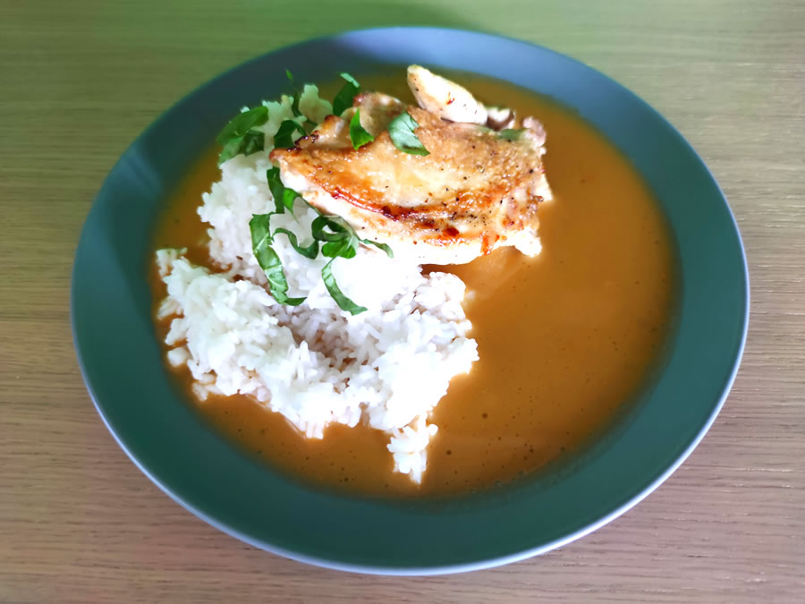

blabla

## Seznam surovin (4 porce)

* Kuře
* Žlutá cibule
* Mletá paprika (sladká)
* Smetana ke šlehání (31 %)
* Rýže
* Máslo
* Mouka nebo škrob
* Sůl
* Pepř

## Postup (1,5 hodiny vaření)

### Příprava surovin - 15 minut

* Rozporcujte a vykostěte **kuře**. Kosti nevyhazujte.
* Oloupejte **cibuli** a nakrájejte nadrobno.

 

### Papriková omáčka - 30-60 minut

* Orestujte **cibuli**, přidejte trošku **másla**, zlehka posypjte škrobem, hojně paprikou, přijte kosti ze stehen a zalejte vodou.

### Maso a rýže - 15 minut

* Dejte vařit rýži v osolené vodě.
* Rozpalte si pánev. Dejte na ni trošku oleje a kůží dospod začněte pomalu opékat kuře.
* Až je kůžička za 10-15 minut pěkně vypečená do křupava, tak otočte a opečte i z druhé strany. Stehno bude trvat už jen cca 2 minuty, prso cca 4 minuty.

###

### Hotovo, servírujeme

* Na talíř dejte **rýži**. Opečený šťavnatý **kuřecí prsní** nebo **stehnení řízek** s křupavou kůžičkou.
* Zalejte **paprikovou omáčkou**.
* Do omáčky dejte trošku výpeku z kuřete.
* Dozdobte nějakou čerstvou bylinkou dle chuti a možností - petržel, pažitka, bazalka.

## Volitelné suroviny, tipy a poznámky

**Mletá paprika** je nejdůležitější surovina na tomto receptu. Obyčejná sladká paprika je fajn. Můžete přidat i trošku pálivé, aby mělo jídlo větší šmrnc. Osobně ujíždím na maďarské paprice. se kterou nemůžete udělat chybu.

**Celé kuře** je na zpracování složitejší než když si koupíte balení stehen nebo stehenních řízků. Má ovšem pár výhod. Naučíte se něco nového. Ušetříte, protože celé kuře je na kila levnější než jednotlivé díly. Získáte zároveň i suroviny a kosti na kuřecí vývar. A kvalitnější kuřata se prostě prodávají v celku.
