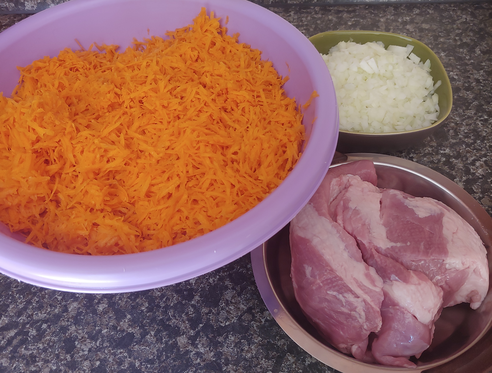
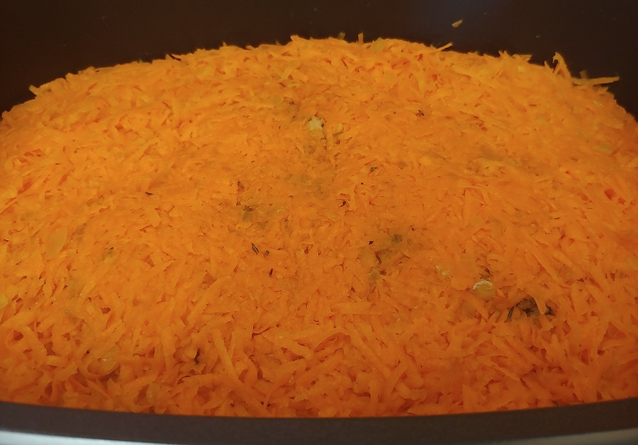
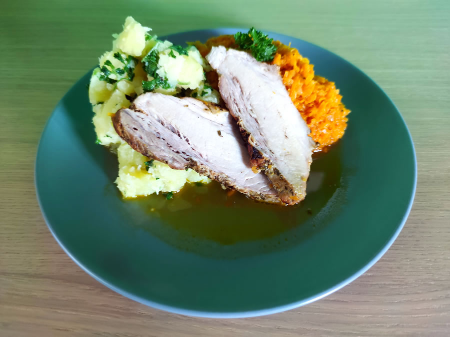

Prim na talíři obvykle hraje maso. U vepřového na mrkvi to není až tak jisté. Maso soupeří o prvenství se skvělými bramborami na másle a petrželkou. A především s mrkví nasáklou vypečenou šťávou z masa. Za mě vítězí mrkev.

## Seznam surovin (6 porcí - 395 Kč)

* Mrkev - 2 kg - 110 Kč
* Žlutá cibule - 0,5 kg - 10 Kč
* Vepřové plecko - 1 kg - 220 Kč
* Brambory - 1,5 kg - 35 Kč
* Petrželová nať (čerstvá) - 20 Kč
* Máslo
* Tymián
* Pepř
* Sůl
* Voda

## Postup (3 hodiny vaření)

Recept je velice jednoduchý, ale přípravy jsou nečekaně zdlouhavé. Oškrábat a nastrouhat dvě kila mrkve prostě trvá. Ani cibule není úplně málo. 

### Příprava surovin a začátek pečení - 1,5 hodiny

* **Mrkev** oškrábejte, očistěte, nastrouhejte nadrobno a dejte do velkého pekáče.
* **Cibuli** oloupejte a nakrájejte nadrobno.
* Rozehřejte pánev a dejte na ni smažit **cibuli** pěkně dozlatova.
* **Vepřové plecko** vyndejte z lednice, řádně **osolte**, **opepřete** a okořeňte **tymiánem**.
* Hotovou **cibuli** promíchejte v pekáči s **mrkví**. Směs **osolte** a **opepřete**.
* Rozehřejte si troubu na 220°C.
* Na rozehřáté pávni zprudka opečte **vepřové plecko**, aby se maso zatáhlo.
* Maso předejte do pekáče a mrkvovo-cibulovou směsí ho kompletně zakryjte. Podlejte **vodou**.
* Pekáč přikryjte a dejte do trouby.
* Troubu stáhněte na 180°C a pečte cca 60 minut.

### Pečení + příprava a vaření brambor - 90 minut  

* **Petrželovou nať** propláchněte, oberte ze stonků a pokrájejte nadrobno.
* **Brambory** oškrábejte, očistěte a pokrájete na stejně velké kousky.
* Dejte **brambory** vařit do **osolené** vody. Můžete přidat i stonky petržele.
* Po uběhnutí 60 minut vyndejte pekáč z trouby. Na chvíli vyndejte maso bokem.
* Mrkvovou směs pořádně promíchejte. Dle potřeby dochuťte a znovu podlejte **vodou**.
* Mrkev je v této chvíli ještě trochu tvrdá.
* Vraťte maso do pekáče, přikrejte a dejte do trouby na dalších 30 minut stále při 180°C.
* Slijte uvařené brambory. Petrželové stonky vyhoďte.
* Do brambor přihoďte poctivou dávku **másla**, pokrájenou **petrželovou nať** a promíchejte.

### Hotovo, servírujeme

* Na talíř dejte **brambory s máslem a petrželkou**.
* Přidejte **mrkev s cibulí a vypečenou štávou**.
* Dle velikosti jeden až tři plátky měkkého **vepřového plecka**.

## Volitelné suroviny, tipy a poznámky

* Původně jsme maso na mrkvi pekli klasickým způsobem. Ale po delším experimentování a neustálém zvyšování dávky mrkve se jedná spíše o **brazírování**. Tedy dušení zprudka opečeného masa v tekutině. Tekutinu zde vytváří mrkvová šťáva a voda na podlití.
