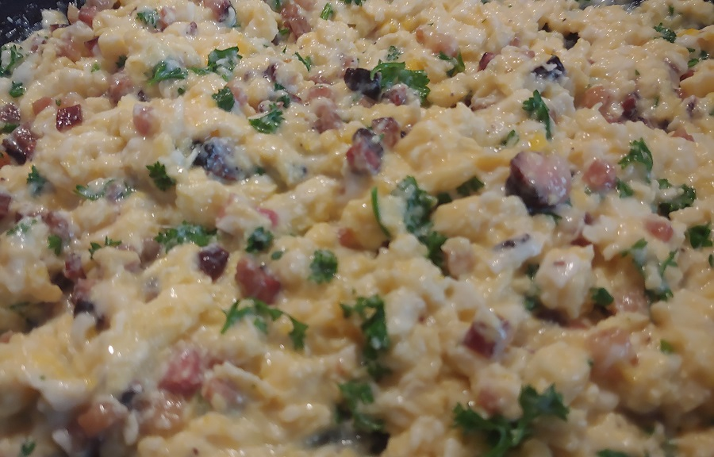
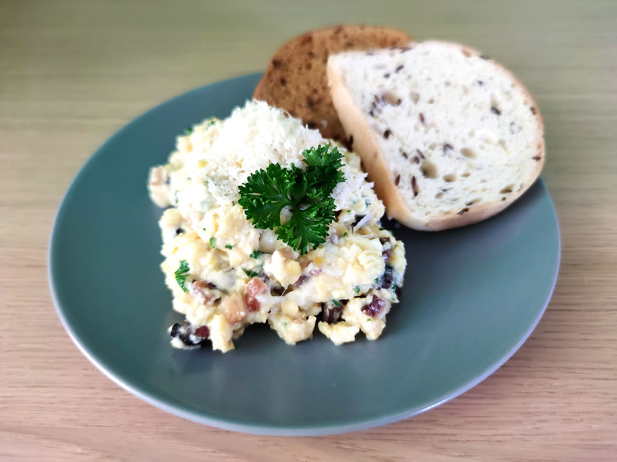

Prim na talíři obvykle hraje maso. U vepřového na mrkvi to není až tak jisté. Maso soupeří o prvenství se skvělými bramborami na másle a petrželkou. A především s úžasnou mrkví nasáklé vypečenou šťávou z masa. Za mě vítězí mrkev.

## Seznam surovin (2 porce - 110 Kč)

* Vejce - 6 ks - 50 Kč
* Slanina - 100 g - 30 Kč
* Parmazán - 10 g - 10 Kč
* Čerstvá petrželová nať nebo pažitka - 5 Kč
* Pepř
* Sůl
* Pečivo - 3 ks - 15 Kč (tři plátky bezlepkového chleba Schar)

## Postup (15 minut vaření)

Tohle musí zvládnout každý.

### Příprava surovin - 5 minut

* **Slaninu** nakrájejte na malé kousky.
* **Petrželovou nať** propláchněte, oberte ze stonků a pokrájejte nadrobno.
* **Vajíčka** rozklepněte do misky.

### Slanina - 5 minut

* **Slaninu** opečte na pávni.
* Vypečený tuk slejte bokem.

### Vajíčka - 5 minut

* **Vajíčka** přilejte do pánve ke slanině a **opepřete**.
* Pravidelně míchejte a odstavujte bokem z plotýnky, aby se vajíčka nevysušily, nepřipekly a nepřichytly k pánvi.
* Finální konzistence má "šťavnatá".
* Pánve odstavte bokem. Lehce **osolte**, přidejte nasekanou **petrželovou nať** a hrstku **parmazánu**. Promíchejte.

### Hotovo, servírujeme

* Na talíř dejte **míchaná vajíčka se slaninou a petrželkou**.
* Posypte **parmazánem** a dozdobte **petrželkou**.
* Podávejte s pečivem dle chuti.

## Volitelné suroviny, tipy a poznámky

* **Vajíčka** se dělají opravdu rychle. Stačí jim 2-3 minuty. Snažte se je nevysušit.
* **Vajíčka** nešlehejte. Stačí je promíchat na pávni.
* Krom vajec a soli můžete přidat nebo ubrat prakticky libovolnou surovinu. Vynechejte slaninu a máte vegetariánský pokrm. Parmazán dáváme do vajíček jen když zbyde z jiného jídla. Záleží na chuti a rozpočtu. Nejdražší suroviny stejně budou vejce, pokud preferujete bio a volný výběh.
* **Čerstvé bylinky** nejsou vždy po ruce. Sušené jsou taky v pohodě, ale nejsou chuťově až tak výrazné.
* Občas se přidává k vajíčkům trošku **mléka**, **smetany** nebo jen **vody**. Mléko a smetana pokrm trošku zjemní. Ale primární účel je zvlhčovací. Tyto komponenty totiž pomohou udržet vejce štavnatější a trošku ubránit před vysušením. Ale třeba skvělá domácí vejce je škoda vylepšovat mléčným produktem. S trochou praxe budou perfektní i bez toho.
