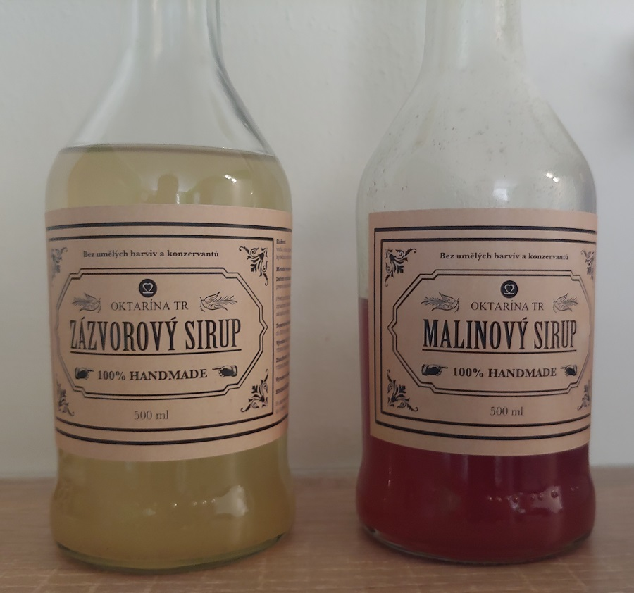
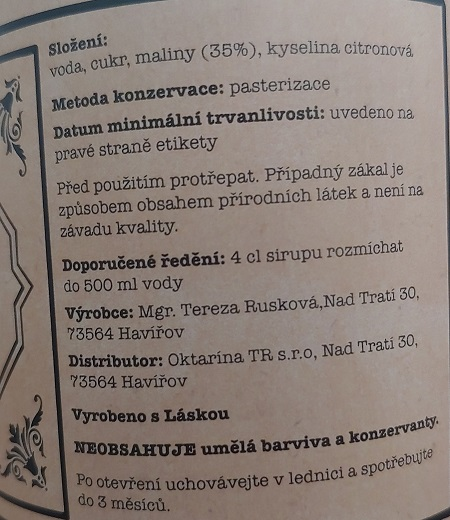
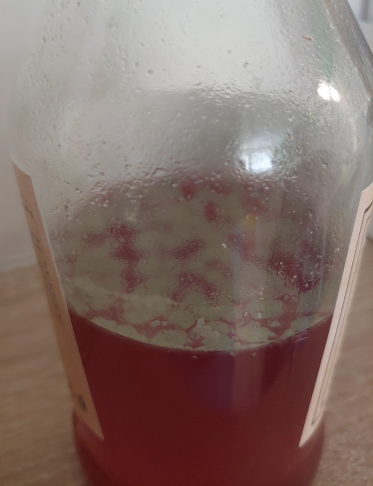

Štáva u nás doma frčí stabilním a svižným tempem. Až se občas nestačím divit. Postupně přecházíme na luxusnější značky a máme rádi domácí a poctivé výrobky. Nemohli jsme si proto nechat ujít sirupy Oktarína. Testované a recenzované sirupy byly dva - Oktarína TR malinový a zázvorový. Jaké to bylo? 

## První dojem

Na první pohled působí sirupy lákavě. Nápis *100% handmade* napovídá, že se jedná o poctivé produkty z lokální ruční malovýroby. Bez barviv a konzervantů. Usazenina na dně naznačuje, že byl malinový sirup skutečně vyroben z malin a zázvorový ze zázvoru. Decentní etiketa dokresluje příjemný první dojem.

## Vůně a chuť

První zklamání přichází rychle po otevření. Zázvorový i malinový sirup mají velmi slabou vůni. Zázvor i malinu je možné identifikovat i když to chvilku trvá. Ale to nemusí nic znamenat.

Druhé zklamání nečeká dlouho. Vyrobená šťáva z naředěných sirupů nemá prakticky žádnou chuť. Najít a identifikovat příchuť maliny nebo zázvoru vyžaduje zatraceně hodně soustředění. Některým se to dokonce nepovedlo vůbec.

Další pokusy logicky vedou k důkladnějšímu protřepávání usazeniny ze dna láhve a zvyšování dávky sirupu. Překvapivě nic nepomáhá. S vyšší dávkou chutná šťáva již pouze po cukru a deklarované příchutě zanikají snad ještě více.

## Konzistence

Tady vidím dost zásadní problém. Konzistence ani trošku neodpovídá jakémukoliv sirupu, který jsem doposud poznal. Není sirupovitá, ale hodně tekutá až skoro vodová. Příliš nízká viskozita navzdory silně cukrové chuti naznačuje nějakou chybu v procesu zpracování surovin a výroby finálního produktu. A logicky z toho nemůže po zředění vzniknout chutná šťáva.

## Složení

Ve složení nevidím žádný problém. Ovocné složky by mělo být v sirupu dostatek. Běžný sirup mívá jen kolem 10-20 % ovocné složky. Oktarína TR deklaruje 35 % malin u malinového a 40 % zázvoru u zázvorového. To je zatraceně štědrá dávka. Nějak nechápu, kde je problém. Škoda, že není přesně uvedeno i množství cukru.

## Chlupaté překvápko

Pěkný benefit je, že po pár dnech se vám v sirupu vyklube roztomilý chlupatý mazlík v podobě plísně. Tohle je moje blbost. Sirup je nutné uchovávat v lednici a vlastně to není až tak velké překvapení, protože u podobných produktů s usazeninou se to stává. Není to chyba výrobce.

Malinový sirup má trvanlivost mimo lednici kolem 2 týdnů. Zázvorový kolem 4 týdnů. Upřímně je to jedno. Oba nakonec skončily vylité do odpadu.

Potravinami opravdu nerad plývám a snažím se vyhazovat minimum jídla. Ale co s hnusným sirupem, který už nikdo nechce pít. Nechutnal nám a nezaujal ani návštěvy, kterým jsme ho zkusili nabídnout.

## Verdikt

Cena sirupu se pohybuje kolem 130 Kč za 500 ml. Prémiovému poctivému produktu by cenovka v pohodě odpovídala. Bohužel tohle není prémiový produkt. Ano, je bez barviv a konzervantů. Dost možná je i ručně vyráběný, to nemám jak poznat. Ale celková kvalita - vůně a především chuť a viskozita - absolutně neodpovídají ceně. Možná za 50 korun. Možná ani to ne.

Nerozumím proč tohle šlo do prodeje. Receptura zjevně není vyladěná a má do toho ještě zatraceně daleko. Tady je nutné podotknout, že na trhu již nějakou chvíli jsou a pomalu pronikají i do supermarketů. Takže to asi lidem chutná .

Mně tedy rozhodně nechutná a znovu už tyhle sirupy pít nechci. Kdybych chtěl pít sladkou vodu bez chuti, tak si do ní můžu přidat lžíci cukru. Výsledek bude stejný a ušetřím spoustu peněz.

## P.S.:

Ještě úplně na závěr bych chtěl podotknout, že podobným výrobcům celkem fandím a rád je podporuji. Tohle se bohužel moc nepovedlo.

Pustím se schválně do experimentu a zkusím vyrobit vlastní sirup. O výsledek se podělím na tomto blogu.
