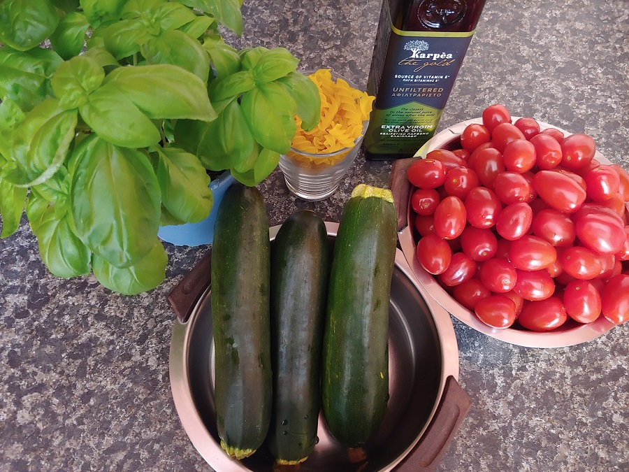
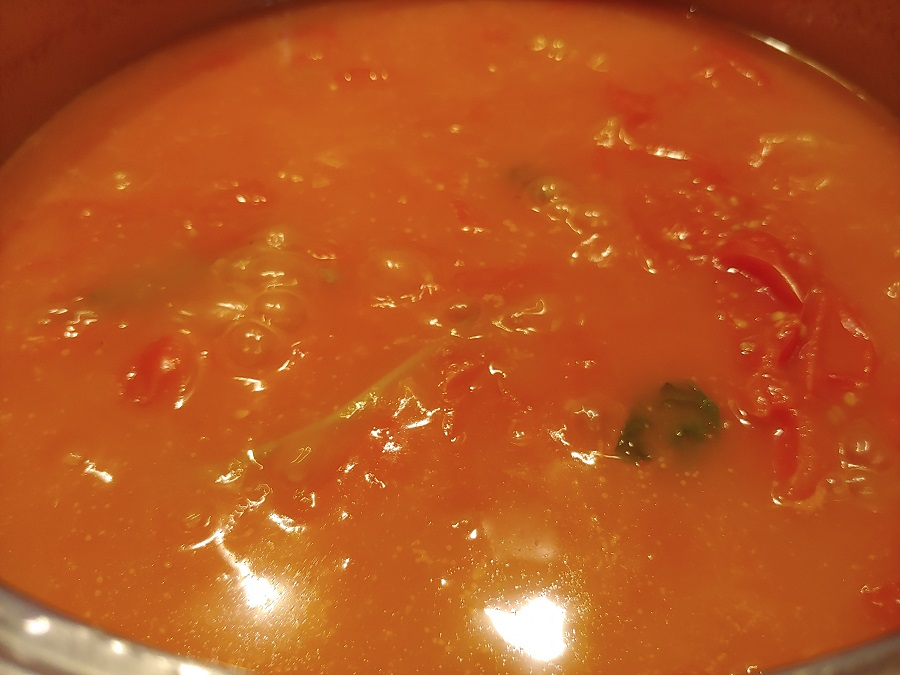
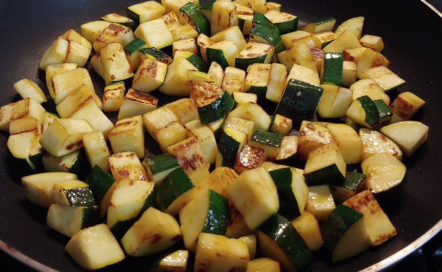
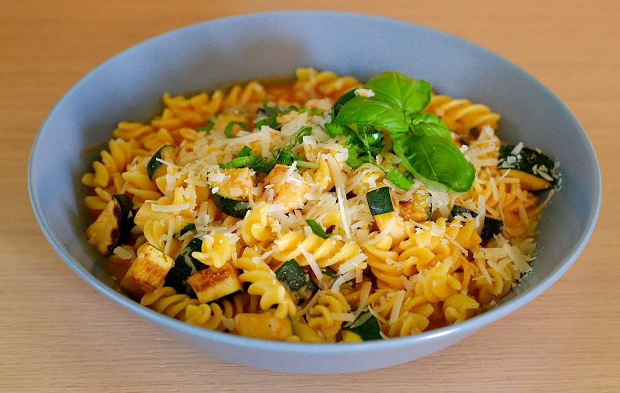

Lehký vegetariánský oběd inspirovaný italskými pokrmy. Vynikající chuť čertvých rajčat a voňavé bazalky.

## Seznam surovin (4 porce - 180 Kč)

* Cherry rajčata - 1 kg - 120 Kč
* Bazalka (čerstvá) - 50 Kč
* Parmazán - 20 g - 10 Kč
* Olivový olej
* Těstoviny
* Pepř
* Sůl
* Cukr
* Voda

## Postup (55 minut vaření)

Jednoduché rychlé.

### Příprava surovin - 10 minut

* **Cherry rajčata** opláchněte a překrojte na poloviny.
* **Bazalku** oberte. Stonky i lístky propláchněte vodou.
* **Cuketu** pokrájejte na kostičky.

### Omáčka - 30 minut

* V kastrůlku rozehřejte štědrou dávku **olivového oleje**.
* Do rozehřátého oleje dejte překrájená **rajčata**.
* Přibližně 5-10 minut povařte až rajčata získají tekutější konzistenci.
* K rajčatům přihoďte **stonky bazalky**, několik **bazalkových lístků**, polévkovou lžíci **cukru**, **mletý pepř** a **sůl**.
* Přilejte cca půl **litru vody** a 30 minut vařte na mírném plameni.

### Pasírování a doladění omáčky - 10 minut

* Dejte s předstihem vařit vodu na těstoviny.
* Připravte si prázdný kastrůlek, sítko a uvařenou rajčatovou směs propasírujte přes jemný cedník.
* Po propasírování by omáčce neměly zbýt žádná semínka a slupky z rajčat a bazalka.
* Omáčku trošku prožeňte tyčovým mixérem.
* Ochutnejte a dolaďte omáčku **solí**, **pepřem** a **cukrem**.
* Vypněte plament a přidejte několik nadrobno pokrájených **bazalkových lístků**.

### Cuketa a těstoviny - 5 minut

* **Těstoviny** vhoďte do připravené osolené vroucí vody.
* Na pánvi rozehřejte olivový olej a zprudka orestujte **cuketu**.

### Hotovo, servírujeme

* Do hotových **těstovin** přidejte **cuketu** a trošku **parmazánu**. Promíchejte.
* Přilejte **rajčatovo-bazalkovou omáčku** a znovu promíchejte.
* Posypejte **parmazánem** a nasekanou **bazalkou**.

## Volitelné suroviny, tipy a poznámky

* Výsledná chuť omáčky se bude nejvíce odvíjet od rajčat. Nejlepší jsou cherry rajčata, protože bývají sladší a výraznější.
* Ideální je používat čerstvou bazalku, ne sušenou.
* Aby byl pokrm bezlepkový a veganský je nutné použít bezlepkové kuřičné těstoviny bez vajíček.
